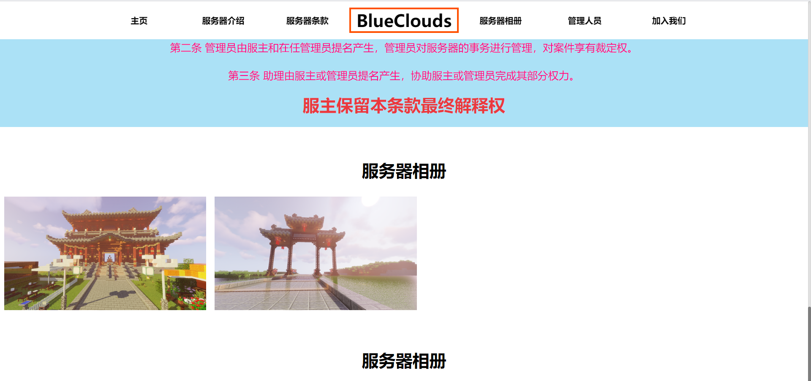
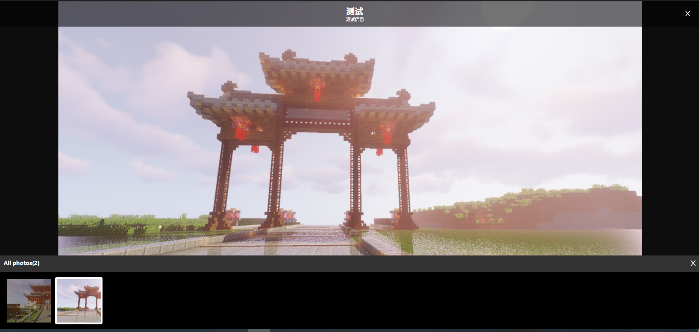

# Picture-Gallery

一个简单的画廊实现

[](https://github.com/sequelize/sequelize/blob/master/LICENSE)

## 如何使用？

+ 拉取文件 git clone git@github.com:FeiBam/Picture-Gallery.git
+ 在项目中直接引入vue文件
    - ```
      import PictureGallery from "../../components/PictureGallery";
            export default {
                 name: "index",
                 components:{
                     'picture-gallery':PictureGallery
                 },
      ```
+ 给标签传递一个数组
    - ```
      <picture-gallery :picture-arr="picArr"></picture-gallery>
      data(){
          return{
              picArr:[
                  {
                      title:'I am a Title',
                      info:'I am a info',
                      picture:require('../../assets/banner/banner1.jpg')
                  }
              ]
          }
      }
      ```
    - 传递参数格式：
      |  name   | type  |
      |  ----  | ----  |
      | title  | string |
      | info  | string |
      | picture|string|
      
      picture 为你的图片链接地址可以是url,如果是项目本地文件 务必使用 require('../***.png')来导入


## 效果





## License

[MIT](http://opensource.org/licenses/MIT)

